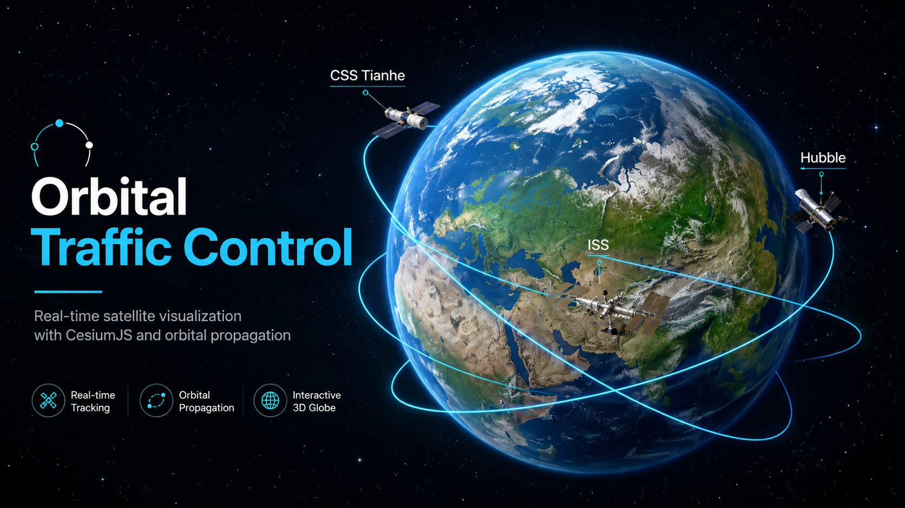

# Orbital Traffic Control



A real-time 3D satellite visualization project built with **Next.js, TypeScript, CesiumJS, and satellite.js**.

Orbital Traffic Control uses real orbital data from **CelesTrak** and SGP4 propagation to calculate satellite positions over time and render them around an interactive 3D Earth.

## Features

* Interactive 3D Earth powered by CesiumJS
* Real satellite orbital data using TLEs from CelesTrak
* SGP4 satellite position propagation with `satellite.js`
* Real-time satellite movement based on simulation time
* Orbital trail visualization
* Multiple tracked satellites, currently including:

  * International Space Station (ISS)
  * Hubble Space Telescope
  * CSS Tianhe / Tiangong Space Station
* Adjustable Cesium simulation clock architecture

## How It Works

The main orbital pipeline is:

```text
CelesTrak TLE Data
        ↓
satellite.js
        ↓
SGP4 Propagation
        ↓
ECI Coordinates
        ↓
Geodetic Longitude / Latitude / Altitude
        ↓
Cesium Cartesian3
        ↓
3D Satellite Visualization
```

Satellite TLE data is parsed into reusable satellite records. The application then calculates each satellite's position for the current simulation time and converts the result into Cesium's 3D coordinate system.

Orbital trails are generated by sampling satellite positions across a window of time and connecting the resulting 3D points.

## Tech Stack

* **Next.js**
* **React**
* **TypeScript**
* **CesiumJS**
* **satellite.js**
* **CelesTrak orbital data**
* **SGP4 orbital propagation**

## Running Locally

Clone the repository and install dependencies:

```bash
git clone <repository-url>
cd orbital-traffic-control
npm install
```

Start the development server:

```bash
npm run dev
```

Then open:

```text
http://localhost:3000
```

The project automatically copies the required Cesium runtime assets into the `public/` directory during installation.

## Project Goal

The goal of Orbital Traffic Control is to build an interactive space-traffic visualization system while exploring orbital mechanics, real-world satellite data, 3D geospatial rendering, and scalable software architecture.

Future development will expand the satellite catalog and introduce additional interaction, filtering, telemetry, time controls, satellite selection, and other orbital visualization tools.
